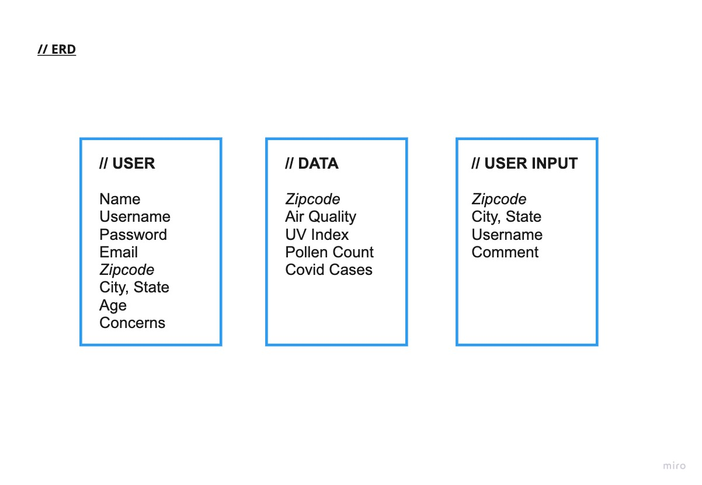

# "Is it safe to go outside?"

*Project #2 / Full-stack Application*

### **INSTALLATION**

- HTML
- CSS
- Javascript
- Express
- Liquid
- Mongoose
___
### **API SOURCES**
Weather API

https://www.weatherapi.com/docs/

Pollen Count

https://docs.breezometer.com/api-documentation/pollen-api/v2/

___
### **USER STORY**

As a user who is immunocompromised, I want access to my local enviromental conditions and disease cases, so I can decide if there are any major health implications for me to go outside. 
___
### **GOAL STATEMENT**

The “Is it safe to go Outside” app allows the users to search the air quality, UV index and pollen counts, which will allow users to take more control of how they interact with the enviroment and public. We will measure effectiveness by allowing users to comment by zip code of any environmental implications that could affect someone with health issues.

___
### **ENTITY-RELATIONSHIP DIAGRAM**

___
### **WIREFRAMES**

### **STRETCH GOALS**

Influenza/ covid cases
https://disease.sh/

Comment model - Users can give their input on the current conditions in their location. 

