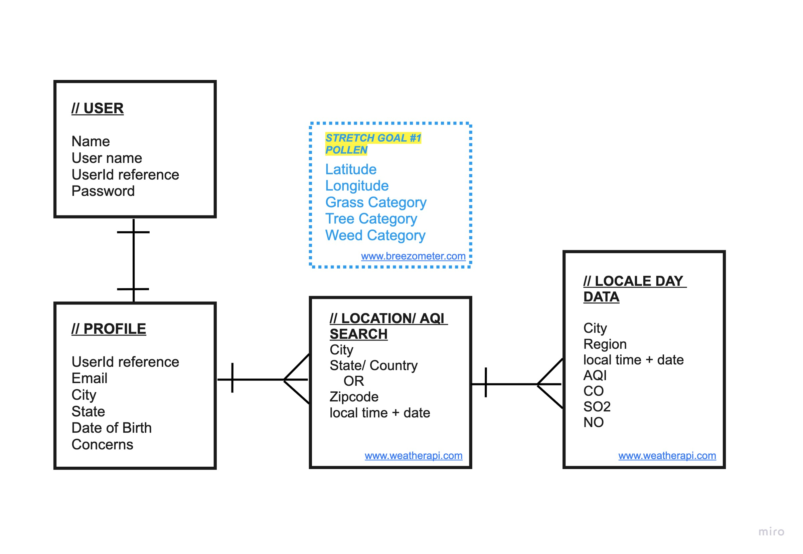

# airQI App

*SEI Project #2 / Full-stack Application*

The airQI app is a tool for users to search the air quality in real time and save the air quality data to their journals. The user is able to add their own input/ notes whether from their own personal sensors or just notes and thoughts for each saved post. The user is able to create a porfile that and get access to their saved searches. 

## Tech Used
___

- Node js
- Mongoose
- Express
- Liquid
- Axios
- Bcrypt
- Bootstrap

## Installation
___

1. Fork and clone this repository.
2. Change to the directory containing the files.
3. Run npm install.
4. Open your text editor.
5. Run npm start in your terminal. 

```
$ cd ../airQI
$ npm install
$ code .
$ npm start
```

## Entity-Relationship Diagram
___



## User Story
___

As a user who is concerned about the outdoor air quality, I want access to my local enviromental conditions in realtime and to be able to save it to a journal that I can edit and add my own notes to. 

## Wireframes
___


## API Source
___
Weather API

https://www.weatherapi.com/docs/
