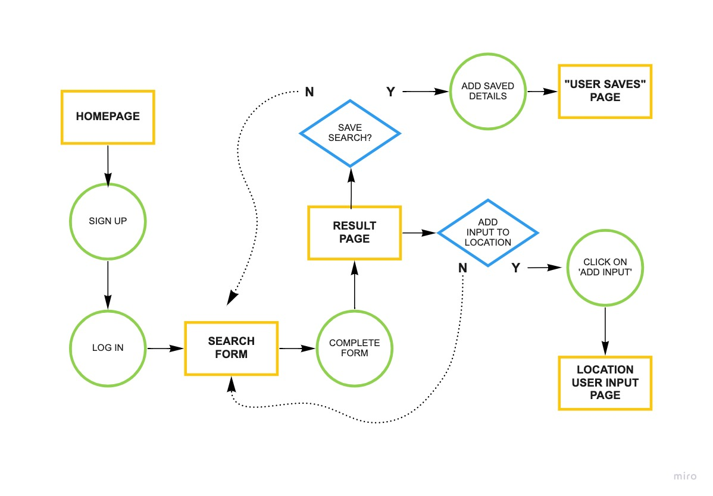

# "Is it safe to go outside?"

*Project #2 / Full-stack Application*

### **INSTALLATION**

- HTML
- CSS
- Javascript
- Express
- Liquid
- Mongoose
___
### **SOURCES**
Pollen Count

https://docs.breezometer.com/api-documentation/pollen-api/v2/

Air Quality & Weather Data

https://www.iqair.com/air-pollution-data-api

Health Data 

https://data.cms.gov/provider-data/
___
### **USER STORY**

As a user who is immunocompromised, I want access to my local enviromental conditions and disease cases, so I can decide if there are any major health implications for me to go outside. 
___
### **GOAL STATEMENT**

The “Is it safe to go Outside” app allows the users to search the air quality, UV index and Covid/ Influenza cases, which will allow users to take more control of how they interact with the enviroment and public. We will measure effectiveness by allowing users to comment by zip code of any environmental implications that could affect someone with health issues.
___
### **USER JOURNEY**

___
### **WIREFRAMES**

___
### **ERD - Models**

